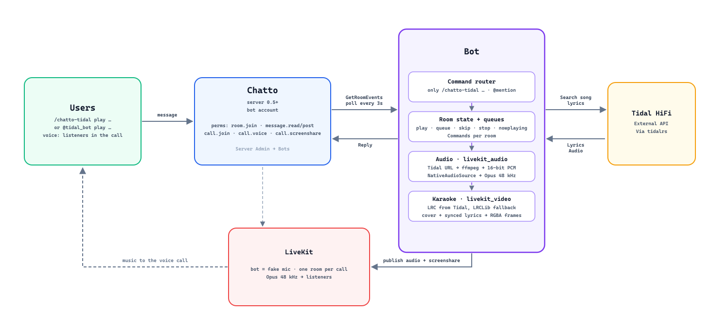

# Chatto Tidal Bot

A music bot for [Chatto](https://github.com/chattocorp/chatto) that plays **Tidal HiFi** streams in voice channels via LiveKit. 
Supports **multiple rooms and voice channels simultaneously** — each room gets its own independent queue and playback.

> **Requires Chatto 0.5+.**
>
> This bot runs as a native **bot account** (`Server Admin → Bots`) and authenticates
> with a **bot API key** (`cht_BK_…`), as introduced in Chatto 0.5.


## Architecture



## Prerequisites

- A Chatto server running **0.5 or later** with LiveKit configured
- A **Tidal HiFi Plus** account
- `ffmpeg` installed on the bot machine

## Build

```bash
cargo build --release -p chatto-bot-tidal

# or

task build
```

## Development Tasks

This project uses [Task](https://taskfile.dev) (task.dev) for common developer workflows.

```bash
task --list
task fmt
task test
task dev
```

## Configuration

Copy `config.example.json` → `config.json` and fill in the fields:

```json
{
    "chatto_url": "https://chat.example.com",
    "chatto_token": "cht_BK_...",
    "livekit_url": "wss://livekit.example.com",
    "tidal_token_path": "tidal_token.json",
    "tidal_quality": "HI_RES_LOSSLESS",
    "sample_rate": 48000,
    "bot_name": "tidal_bot",
    "rooms": [
        "R1YR23T6P9wamep"
    ],
    "poll_interval": "3s",
    "volume": 60,
    "default_lyrics": false,
    "thread_replies": false
}
```

### `chatto_token` — Bot API key

Since Chatto 0.5, bots have first-class **bot accounts** with their own API keys.

**1. Create the bot**: open **Server Admin → Bots → Create Bot** on your Chatto
server. Choose a username ending in `_bot` (e.g. `tidal_bot`), a display name,
and a name for the first API key.

**2. Copy the API key** (`cht_BK_…`) into `chatto_token` (or the `CHATTO_TOKEN`
env var). Chatto shows the raw key only once. Treat it like a password: keep it
out of source control and logs.

**3. Grant the bot the permissions it needs** on the bot's detail page
(Server Admin → Bots → the bot). Bot permissions are an explicit allowlist
starting empty, limited by the owner's own permissions:

| Permission | Needed for |
|------------|------------|
| `room.join` | Joining the rooms listed in `rooms` on startup |
| `message.read` | Reading chat commands in those rooms |
| `message.post` | Replying with queue/now-playing messages |
| `message.post-in-thread` | Replying inside the thread of the command (only with `thread_replies`) |
| `call.join` | Joining the room's voice call |
| `call.voice` | Publishing the music track to the call |
| `call.screenshare` | Publishing the karaoke lyrics video track (`/lyrics`) |

You can also manage room membership directly from the bot's detail page
(**Joined** row) without waiting for the bot to self-join.

> Each bot supports up to 20 named API keys; create one per integration and
> revoke individually. Old human session tokens (`cht_…`) are no longer
> accepted by 0.5 servers.

### `bot_name` — Bot display name

Used as a fallback to recognize mentions (`@tidal_bot play ...`); the primary
match is the bot's actual login, fetched automatically from the server via
`GetViewer` at startup. If omitted, defaults to `"tidal_bot"`.

### `chatto_url` — API endpoint

The base URL of your Chatto server (e.g. `https://chat.example.com`). Do **not** include a trailing slash.

### `livekit_url` — LiveKit server URL

Defined in your Chatto configuration (`LIVEKIT_HOST` env var or config file). The bot connects via JWT tokens from `CreateCallToken`. Format: `wss://livekit.domain.com` or `ws://IP:7880`.

### `tidal_token_path` — Tidal auth token

Tidal integration is powered by the [`tidalrs`](https://crates.io/crates/tidalrs)
crate (device flow OAuth, automatic token refresh, search, streaming).

The token is obtained automatically on first launch via Tidal's **device
authorization flow**:

```bash
./target/release/chatto-bot-tidal config.json
```

The bot prints a URL and a code. Open the URL in a browser, enter the code,
and authorize Tidal access. The token is saved to the specified file
(default: `tidal_token.json`) and refreshed automatically in the background —
the file is rewritten on every refresh. The format migrated from the old
`OAuthToken` shape to `tidalrs::Authz`; an existing legacy token file is read
transparently and rewritten on the first refresh.

### `tidal_quality` — Stream audio quality

Controls the audio quality requested from Tidal. Valid values:

| Value | Description |
|-------|-------------|
| `"LOW"` | Low bitrate (AAC) |
| `"HIGH"` | High bitrate (AAC) |
| `"LOSSLESS"` | CD-quality FLAC (16bit 44.1kHz) |
| `"HI_RES_LOSSLESS"` | Hi-Res FLAC (up to 24bit 192kHz) |

If omitted or set to an unrecognized value, the bot picks the **best quality available** per track.

### `sample_rate` — Audio output sample rate

Sample rate in Hz for the LiveKit PCM audio track and ffmpeg output. Must be supported by LiveKit (common values: `44100`, `48000`). Defaults to `48000`.

> **Note**: LiveKit only supports 16-bit PCM audio. Setting a higher sample rate (e.g. `192000`) does not increase audible quality — the audio is always resampled to 48kHz Opus before reaching listeners. Use the default `48000` for best compatibility, or `44100` to slightly reduce bandwidth.

### `rooms` — Room IDs

The bot must be a **member** of each room to poll events. On startup it joins
the configured rooms itself via `RoomService.JoinRoom`, which requires the
`room.join` permission granted on the bot's detail page. You can also add it
manually from the bot's **Joined** row (Server Admin → Bots) or through the
Chatto web UI (Room settings → Members → Add user).

To find a room ID, simply open the room in your browser — the ID is in the URL: `https://chat.example.com/rooms/<room_id>`.

> **Note**: Chatto 0.5 also requires the new `message.read` permission for the
> bot to see messages in a room (membership alone is no longer enough), plus
> `message.post` to answer commands.

### `volume` — Default playback volume (0–200)

Initial volume percentage for each room. Can be changed at runtime per room
with `volume`. Default: `20`.

### `default_lyrics` — Karaoke screenshare on join (bool)

When `true`, rooms start with the `/lyrics` karaoke screenshare already
enabled. Default: `false`.

### `thread_replies` — Answer inside the command's thread (bool)

When `true`, every command response is posted as a thread reply under the
message that invoked the bot (or under the thread the command was typed in).
The room timeline stays clean; async messages such as *now playing*
announcements and playback errors still go to the room. Requires the bot to
have the `message.post-in-thread` permission — without it the bot logs a
warning and falls back to room replies. Default: `false`.

Thread commands work both ways: the bot automatically follows and polls the
timelines of the threads it answers in (thread replies never appear in the
room timeline), so typing `/chatto-tidal skip` or `pick 2` inside a thread
just works and the response stays in that thread. Each room tracks its 16
most recently used threads; older threads are dropped and their follow is
forgotten.

## Usage

```bash
./target/release/chatto-bot-tidal [config.json]
```

The bot joins the configured rooms and listens for chat commands. Defaults to `config.json` if no path is given.

| Command | Description |
|---------|-------------|
| `/chatto-tidal play <query \| tidal link>` | Search and play a track, or resolve a Tidal link; several results are listed for `pick` |
| `/chatto-tidal queue` | Show the current queue (pending tracks, requestors, repeat mode) |
| `/chatto-tidal pick <n>` | Choose result *n* from the last search |
| `/chatto-tidal playnext <query \| tidal link>` | Insert a track right after the current one |
| `/chatto-tidal skip` | Skip to the next track |
| `/chatto-tidal stop` | Stop playback and clear the queue |
| `/chatto-tidal remove <n>` | Drop pending track *n* from the queue |
| `/chatto-tidal move <from> <to>` | Reorder pending tracks |
| `/chatto-tidal shuffle` | Randomize the pending queue |
| `/chatto-tidal repeat [off\|all\|one]` | Show or set the repeat mode (no argument cycles it) |
| `/chatto-tidal nowplaying` | Show the current track with position, requestor and audio quality |
| `/chatto-tidal volume <0-200>` | Show or set this room's volume |
| `/chatto-tidal mute` | Mute / unmute playback |
| `/chatto-tidal lyrics` | Toggle the karaoke screenshare |
| `/chatto-tidal stats` | Uptime, per-room status, Tidal quality |
| `/chatto-tidal version` | Show the running bot version |
| `/chatto-tidal help [command]` | Command list, or details for one command |

Short aliases are accepted too: `p`, `q`, `np`, `vol`, `rm`, `next`,
`choose`/`pick`.

Links are resolved directly, no search involved:

```
/chatto-tidal play https://tidal.com/track/52105300/u
/chatto-tidal queue https://tidal.com/album/236663723
/chatto-tidal queue https://tidal.com/playlist/7d81f0a4-2c3e-4a1f-9d1c-1234567890ab
```

Track links enqueue one track; album and playlist links enqueue all
their tracks (up to 50 / 1000 respectively). Artist links are not
supported yet.

The bot only reacts when it is addressed: either with the namespaced
`/chatto-tidal` prefix, or with a mention (e.g. `@tidal_bot play ...`, with or
without the `/`). Everything else — including other clients' slash commands —
is left alone.

The bot auto-joins the voice call when a track starts playing and stays in the call after the queue empties, ready for more tracks. Use `/stop` to leave the call; the bot also leaves on shutdown and unpublishes the karaoke screenshare when `/lyrics` is toggled off.
